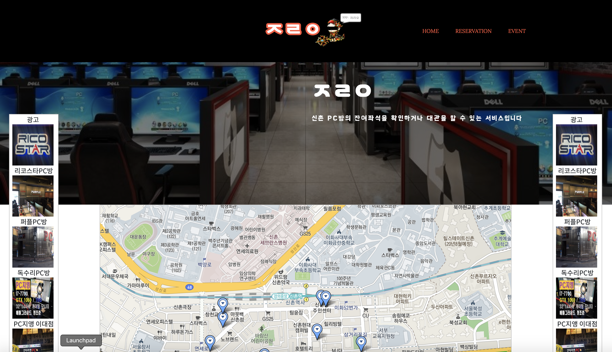

# ㅈㄹㅇ

신촌 PC방 대관 및 예약 서비스
<br>2019 올빼미톤


## 1. 만든사람
김동원(강원대학교)
<br>김화연(이화여자대학교)
<br>박세종(건국대학교)
<br>장제석(연세대학교)

 
## 2. 로컬에서의 구동 방법

### 2.1 가상환경 설치 및 활성화
```
python3 -m venv myvenv
source myvenv/bin/activate
```

### 2.2 Django 설치 및 마이그레이션
```
pip3 install django
python3 manage.py makemigrations 
python3 manage.py migrate 
```

### 2.3 테스트해보기
```
python3 manage.py runserver 
```


